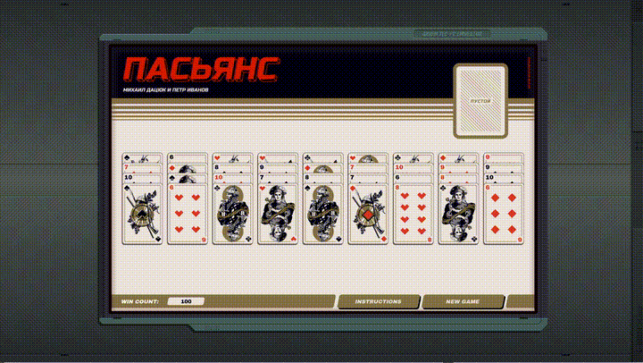

# exapunks_solitaire_bot

This code solves ПАСЬЯНС solitaire as implemented in Exapunks (not intended for public use at this time).

`exa_logic.py` contains all of the code to solve solitaire. `exa_gui.py` contains code to read the screen, detect the game being played, and implement the solution via mouse -- simply run `python exa_gui.py` to read directly from the screen or `python exa_gui.py screenshot.png` to load from a previously saved screenshot. To play multiple games in a row, start a new game, then run `python exa_gui.py loop n` where n is the number of games to play. Running `exa_logic.py` directly generates a random game and solves it.

Currently, the code expects the game to be running in a 1920x1080 window, unobscured, anywhere on the screen, and expects a 2x DPI screen (e.g. Mac Retina). To make it work with other resolutions or DPI scales, edit the pixel offsets found in `config.json`. The computer vision algorithm used to identify cards is OpenCV's template matching, and so when running in other resolutions you should also replace the card sprites found in `card_back/` with resolution appropriate ones.

### Example of graphical autoplay



### Offline solving a randomly generated game


## `config.json` syntax

```
{
	"resolution_scale_click": 0.5, // DPI scaling: 0.5 for 2x DPI (Mac Retina), 1 for standard monitors
	"max_window_x": 1316, // How wide the Solitaire game is in the window from the top left corner
	"max_window_y": 822, // How tall the Solitaire game is in the window from the top left corner
	"stack_width": 134, // How many pixels horizontally to move from card stack to card stack
	"stack_height": 30, // How many pixels vertically to move from card stack to card stack
	"base_stack_offset_x": 55, // From the top left corner of the Solitaire game (anchor.png), how far horizontal to the stack
	"base_stack_offset_y": 332, // From the top left corner of the Solitaire game (anchor.png), how far vertical to the stack
	"freecell_offset_x": 1046, // From the top left corner of the Solitaire game (anchor.png), how far horizontal to the free cell
	"freecell_offset_y": 89, // From the top left corner of the Solitaire game (anchor.png), how far vertical to the free cell
	"card_sprite_x": 22, // How wide are the card sprite clippings (cards/*.png)
	"card_sprite_y": 23, // How tall are the card sprite clippings (cards/*.png)
	"number_stacks": 9, // How many stacks are in the game -- this should be left alone
	"cards_per_stack_base": 4, // How many cards are dealt per stack in a new game -- this should be left alone
	"anchor_filename": "card_back/anchor/anchor.png", // Location of the image that anchors the top-left corner of the game
	"card_filename": "card_back/cards/*.png", // Location of the card images
	"click_offset_x": 40, // How many pixels inside the card should the mouse click, horizontal
	"click_offset_y": 21, // How many pixels inside the card should the mouse click, vertical
	"base_delay": 0.2, // How long to use as a base delay between actions (other delays are multiples of this)
	"window_click_offset_x": 100, // When getting window focus, where should the mouse click, horizontal (leave this alone)
	"window_click_offset_y": 100, // When getting window focus, where should the mouse click, vertical (leave this alone)
	"new_game_offset_x": 1064, // How far from top left corner of window to the new game button, horizontal
	"new_game_offset_y": 780 // How far from top left corner of window to the new game button, vertical
}
```

Two notes:
1. The default values are calibrated for a 1920x1080 window
2. The offsets should not take into account DPI -- `resolution_scale_click` is the only setting that controls monitor DPI
